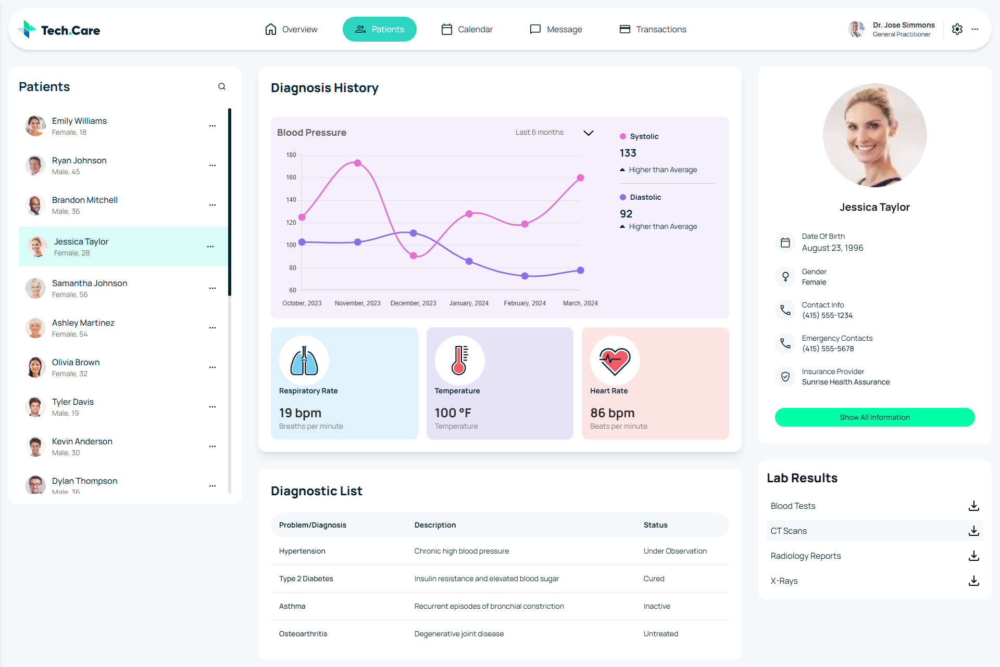

# Tech Care Patient Management Dashboard

This project is a patient management dashboard interface for **Tech Care**, developed using **Next.js 15** and modern libraries to create a seamless, responsive, and intuitive user experience for healthcare providers. This dashboard allows healthcare professionals to monitor, manage, and keep track of patient information and diagnostic history in real-time.

Explore the live preview of this project [here](https://coalition-technologies-fed-skills-test.vercel.app/).

---

## Table of Contents :scroll:

- [Features](#features-star)
- [Demo](#demo-application-screenshot)
- [Installation](#installation-arrow_down)
- [Getting Started](#getting-started)
- [Usage](#usage)
- [Packages Used](#packages-used-package)

---

## Features :features-star:

- **Patient List with Search and Filter**: Easily searchable patient list with debounce functionality for optimized searching. Click on a patient to view detailed information.
- **Patient Overview**: Displays essential details about each patient, including contact information, emergency contacts, and insurance provider.
- **Diagnosis History and Health Metrics**: Visual representations of diagnostic data (blood pressure trends over six months) along with metrics like respiratory rate, temperature, and heart rate.
- **Diagnostic List**: Summary table showing diagnosed conditions, descriptions, and current status ( "Under Observation," "Cured", e.t.c).
- **Lab Results**: Downloadable lab results segmented by category (Blood Tests, CT Scans, Radiology Reports, X-Rays).
- **Responsive Design**: Designed to work on multiple devices for ease of use by healthcare professionals in different environments.

---

## Demo :demo-application-screenshot:



---

## Installation :getting-started:

### Requirements

To run this project, make sure you have the latest versions of **Git** and **Node.js**:

- [Download Git](https://git-scm.com/downloads)
- [Download Node](https://nodejs.org/en/download/)

Verify installation:

```bash
node --version
git --version
```

---

## Getting Started :dart:

### 1. Fork and Clone the Repository

Fork this repository by clicking the "Fork" button at the top right of the page. Then, clone it to your local machine:

```bash
git clone https://github.com/<YOUR-GITHUB-USERNAME>/https://github.com/habibur18/Coalition-Technologies-FED-Skills-Test
cd assessment-for-coalition-tech
```

### 2. Install Dependencies

From the root directory, install the required packages:

```bash
npm install
# or
yarn install
```

### 3. Start the Development Server

Run the development server:

```bash
npm run dev
# or
yarn dev
```

Visit [http://localhost:3000](http://localhost:3000) in your browser to view the application.

---

## Usage :usage

Now You can view .env.example file just rename it .evn extention only. If you are in localhost then `NODE_ENV="development"` will be `development` if you want to host than chnage it to `production`.

```plaintext
NODE_ENV="development"
```

### Patient Search with Debounce

The patient list includes a **search bar with debounce functionality**, optimizing the search experience and reducing unnecessary API calls. This allows the search to only trigger once the user has finished typing, making it smoother and more responsive.

---

## Packages Used :package: #packages-used-package

| Package Name      | Description                                                      |
| ----------------- | ---------------------------------------------------------------- |
| `next`            | Framework for server-side rendering and static web applications. |
| `shadcn/ui`       | UI library for customizable components.                          |
| `lucide-react`    | Icon toolkit for beautiful and flexible icons.                   |
| `react-chartjs-2` | React wrapper for Chart.js, used for visualizing patient data.   |
| `chart.js`        | Data visualization library for charts and graphs.                |
| `react-hook-form` | Library for managing forms and handling form validation.         |
| `tailwindcss`     | Utility-first CSS framework for styling and responsive design.   |
| `zod`             | TypeScript-first schema validation for data validation.          |

---

With these features and modern UI/UX principles, this dashboard provides healthcare professionals with a centralized, efficient, and data-driven interface to manage patient information and health metrics, enhancing productivity and care quality.
